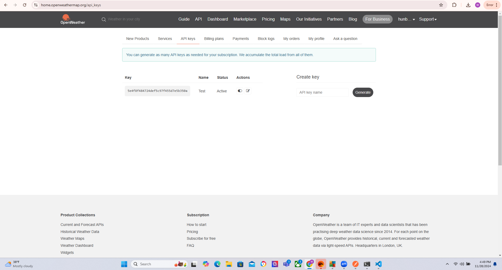
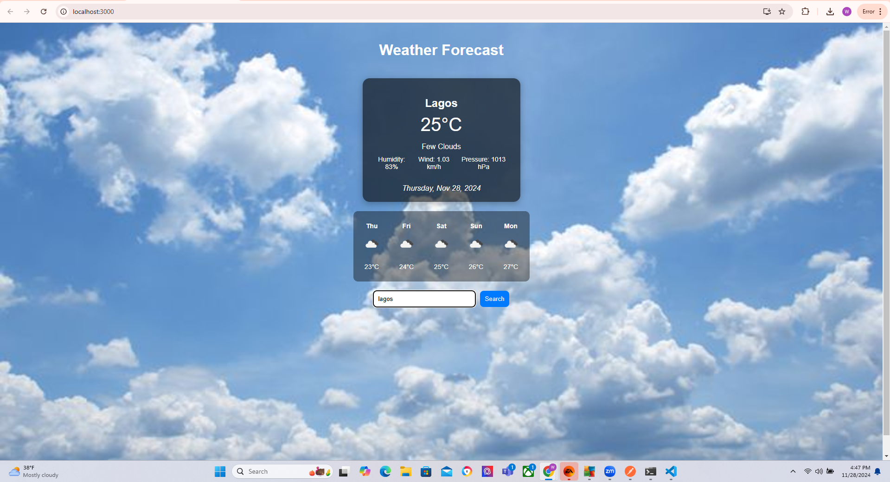
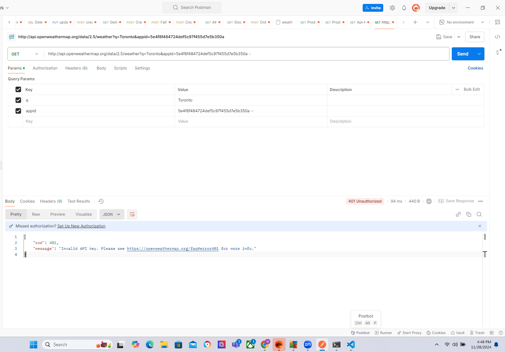
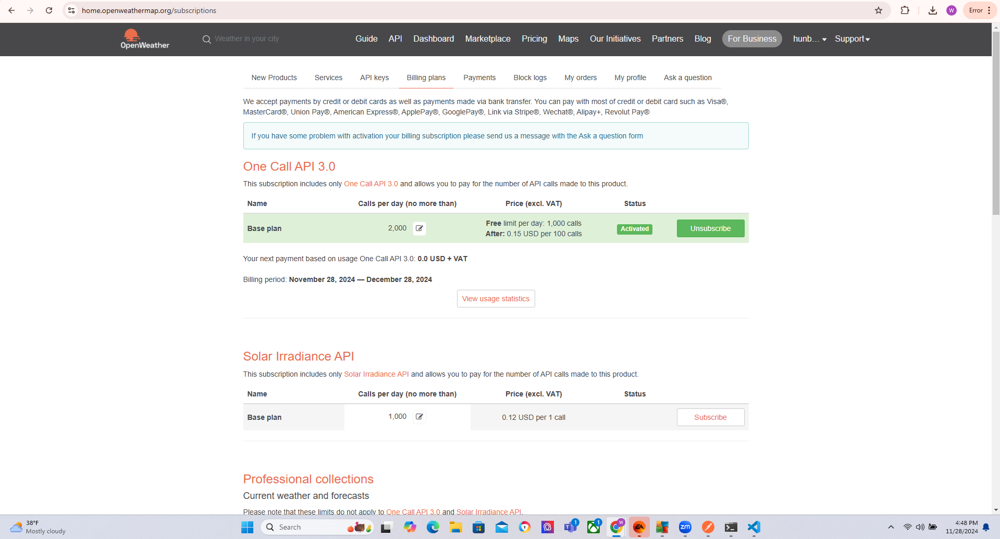

# Weather App - COMP3123 Lab Test 2

This is a simple, user-friendly weather application built using ReactJS that allows users to view the current weather conditions for any city. The app fetches real-time weather data from the OpenWeatherMap API and displays essential information such as temperature, weather conditions, and an icon representing the current weather.

## Project Setup

### 1. Project Setup
- Clone this repository:
git clone https://github.com/hunble01/101395382_comp3123_labtest2.git

### 2. Install Dependencies
- Navigate to the project folder:
cd 101395382_comp3123_labtest2

### 3. API Key Setup
- Create a free account on [OpenWeatherMap](https://openweathermap.org) and obtain your API key.
- Replace the placeholder `{{APIkey}}` in the `apiKey` variable with your actual API key in the `App.js` or wherever the API call is made.
const apiKey = 'your-api-key-here';

### 4. Run the App
- After installation, start the development server:
npm start

- Open the browser and visit `http://localhost:3000`.

## Features
- **Search for any city**: The app allows users to search and view the current weather conditions for any city.
- **Real-time weather data**: The app fetches weather data using the OpenWeatherMap API and displays the current temperature, weather conditions, and a related weather icon.
- **Dynamic Content**: The weather details update dynamically based on user input, allowing users to search for different cities.
- **Responsive Design**: The app is styled to be responsive, providing a user-friendly interface across devices.

## Technologies Used
- ReactJS
- OpenWeatherMap API
- Axios (for API calls)
- CSS for styling

## Screenshots

## API Documentation
- [OpenWeatherMap Current Weather API](https://openweathermap.org/current)
- [OpenWeatherMap Weather Conditions](https://openweathermap.org/weather-conditions)

## Future Improvements
- Add forecast data (daily, weekly).
- Improve UI/UX with better themes or animations.
- Add support for more cities or additional weather metrics (humidity, wind speed, etc.).

## License
This project is licensed under the MIT License - see the [LICENSE](LICENSE) file for details.

---

**Note**: If you face any issues or have questions, feel free to reach out via GitHub Issues or contact me directly.
